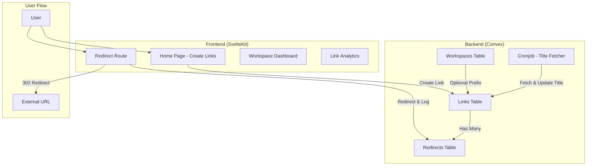
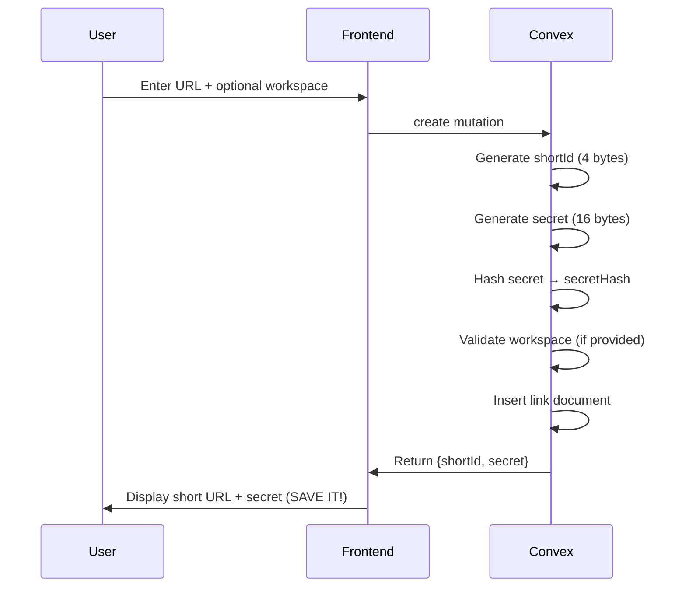
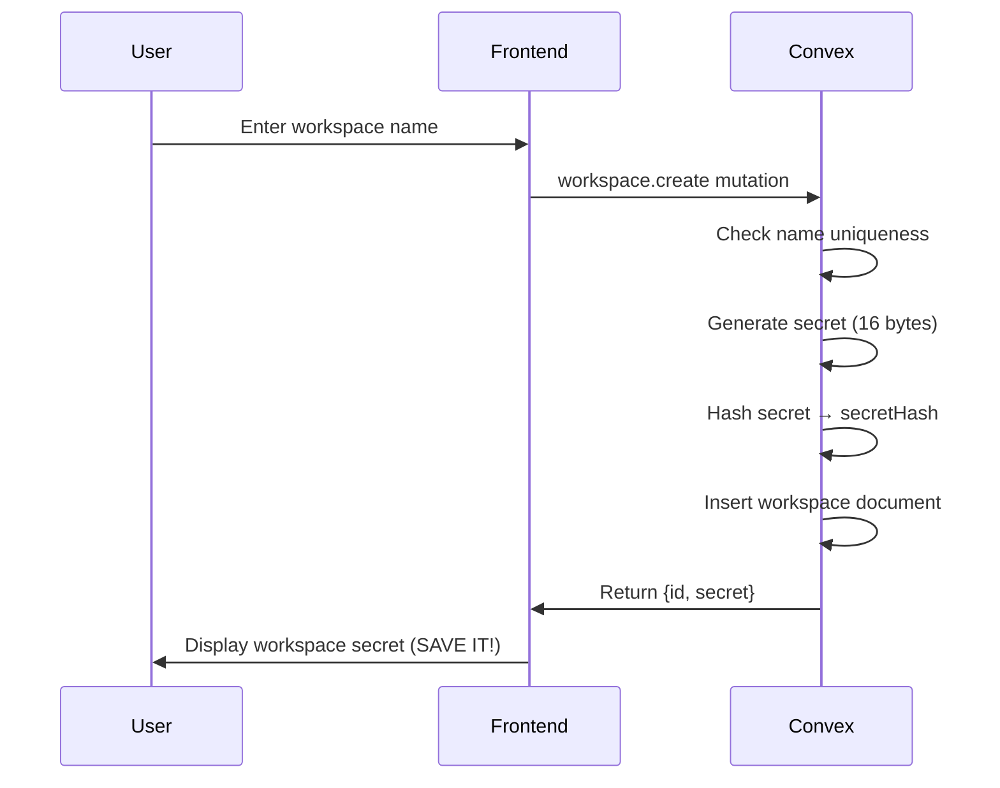
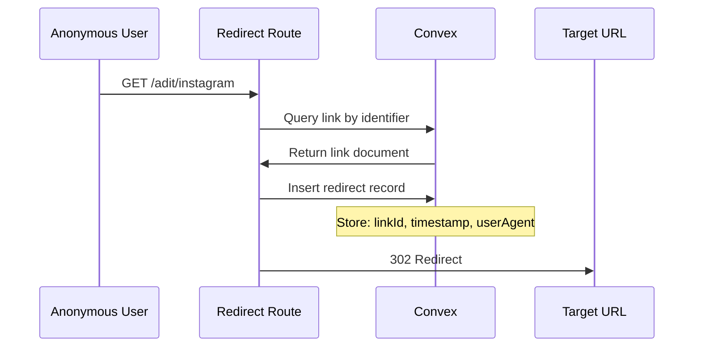
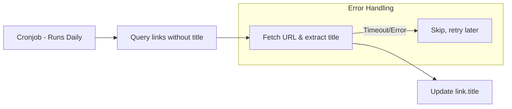

# Link Shortener Service - Detailed Project Goal

## Overview

A privacy-focused, anonymous link shortening service built with **SvelteKit** and **Convex** as the backend database. The service enables users to create shortened URLs without requiring accounts or authentication, while offering optional "Workspaces" for organized link management.

---

## Core Architecture



---

## Database Schema

### 1. Workspaces Table

| Field        | Type     | Description                                                     |
| ------------ | -------- | --------------------------------------------------------------- |
| `name`       | `string` | Unique workspace identifier (e.g., "adit") - acts as URL prefix |
| `secretHash` | `string` | SHA-256 hash of the workspace secret (used for authentication)  |

**Purpose**: Workspaces allow grouping links under a memorable prefix. For example, a workspace named `adit` (Adit College) would create links like `/adit/instagram`.

### 2. Links Table

| Field         | Type                | Description                                                    |
| ------------- | ------------------- | -------------------------------------------------------------- |
| `shortId`     | `string`            | Auto-generated 4-6 byte unique identifier (URL-safe Base64)    |
| `shortName`   | `string?`           | **TO BE ADDED** - Optional memorable alias (e.g., "instagram") |
| `secretHash`  | `string`            | SHA-256 hash for link management authentication                |
| `url`         | `string`            | Target URL for redirection                                     |
| `title`       | `string?`           | Page title fetched by cronjob                                  |
| `workspaceId` | `Id<'workspaces'>?` | Optional reference to parent workspace                         |

**URL Resolution Priority**:

1. If link has `shortName` and matches → `/[workspace?]/[shortName]`
2. Falls back to `shortId` → `/[workspace?]/[shortId]`

### 3. Redirects Table

| Field       | Type          | Description                                                      |
| ----------- | ------------- | ---------------------------------------------------------------- |
| `linkId`    | `Id<'links'>` | Reference to the link that was accessed                          |
| `timestamp` | `number`      | **TO BE ADDED** - Unix timestamp of redirect                     |
| `userAgent` | `string?`     | **TO BE ADDED** - Browser user agent                             |
| `ip`        | `string?`     | **TO BE ADDED** - Client IP (privacy-conscious, could be hashed) |
| `referer`   | `string?`     | **TO BE ADDED** - Referring URL                                  |

**Purpose**: Minimal analytics tracking without invasive data collection.

---

## Key Features

### 1. Anonymous Link Creation

Users can create shortened links without registration:

1. Enter target URL
2. Optionally provide workspace credentials (name + secret) to add link to a workspace
3. Optionally provide a custom `shortName` (e.g., "instagram" → `/adit/instagram`)
4. System returns:
   - `shortId`: Auto-generated unique ID
   - `secret`: One-time secret for link management (shown once!)



### 2. Workspace System

Workspaces provide organized namespaces for links:

| Use Case | Example                                             |
| -------- | --------------------------------------------------- |
| College  | `/adit/instagram` → Instagram page for Adit College |
| Company  | `/acme/careers` → Careers page                      |
| Event    | `/hack2024/register` → Event registration           |

**Workspace Creation Flow**:



**Important**: The secret is shown **only once** when creating a workspace or link. This is the only way to manage the resource later.

### 3. Short Names (Custom Aliases)

**Feature to implement**: Links can have an optional `shortName` for memorable URLs.

```
Without shortName:  /adit/xK7mP  (random shortId)
With shortName:     /adit/instagram  (memorable alias)
```

**Resolution Logic**:

```typescript
// Route: /[workspace]/[identifier]
// Priority:
1. Try to find link with shortName === identifier in workspace
2. Try to find link with shortId === identifier in workspace
3. Try to find link with shortName === identifier (no workspace)
4. Try to find link with shortId === identifier (no workspace)
```

### 4. Redirect Analytics

Minimal, privacy-conscious tracking:



**Analytics Data Points**:

- Total redirects per link
- Redirects over time (hourly/daily aggregates)
- Basic device type (parsed from user agent)
- Referrer domains (optional)

**NOT collected**:

- IP addresses (or stored as hashed/bucketed)
- Personal identifiable information
- Tracking cookies

### 5. Title Generation Cronjob

A scheduled job fetches and updates page titles:



**Implementation**:

```typescript
// Convex scheduled function
export const fetchTitles = internalMutation({
	handler: async (ctx) => {
		const links = await ctx.db
			.query('links')
			.filter((q) => q.eq(q.field('title'), undefined))
			.take(100);

		for (const link of links) {
			try {
				const title = await fetchPageTitle(link.url);
				await ctx.db.patch(link._id, { title });
			} catch {
				// Skip on error, will retry next run
			}
		}
	}
});
```

---

## User Interface Design

### Design Philosophy: "Super Minimal Yet Beautiful"

**Theme**: shadcn-svelte Violet (already configured)

- Primary color: `oklch(0.606 0.25 292.717)` - A rich violet
- Dark mode support included

### Pages Structure

```
/                           → Home: Create new link
/[workspace]/[identifier]   → Redirect route
/workspace/[name]           → Workspace dashboard (requires secret)
/link/[id]                  → Link details & analytics (requires secret)
```

### Page Mockups

#### 1. Home Page (`/`)

```
┌─────────────────────────────────────────────┐
│                  🔗 link                     │
├─────────────────────────────────────────────┤
│                                             │
│   ┌─────────────────────────────────────┐   │
│   │ Enter your URL...                   │   │
│   └─────────────────────────────────────┘   │
│                                             │
│   Optional:                                 │
│   ┌───────────────────┐ ┌────────────────┐  │
│   │ Custom short name │ │ Workspace      │  │
│   └───────────────────┘ └────────────────┘  │
│                                             │
│   ┌─────────────────────────────────────┐   │
│   │ Workspace Secret (if using workspace)│  │
│   └─────────────────────────────────────┘   │
│                                             │
│        [ Create Short Link ]                │
│                                             │
└─────────────────────────────────────────────┘
```

#### 2. Link Created Success State

```
┌─────────────────────────────────────────────┐
│                  ✅ Link Created!            │
├─────────────────────────────────────────────┤
│                                             │
│   Your short link:                          │
│   ┌─────────────────────────────────────┐   │
│   │ https://link.app/adit/instagram  [📋]│   │
│   └─────────────────────────────────────┘   │
│                                             │
│   ⚠️ Save your secret (shown once!):        │
│   ┌─────────────────────────────────────┐   │
│   │ Xk9f2mP7vQ3s...                  [📋]│   │
│   └─────────────────────────────────────┘   │
│                                             │
│   [ View Analytics ] (requires secret)      │
│                                             │
└─────────────────────────────────────────────┘
```

#### 3. Workspace Dashboard (`/workspace/[name]?secret=...`)

```
┌─────────────────────────────────────────────┐
│   📁 adit                        [+ New]    │
├─────────────────────────────────────────────┤
│                                             │
│   ┌─────────────────────────────────────┐   │
│   │ 🔗 instagram → instagram.com/adit   │   │
│   │    1,234 redirects                  │   │
│   └─────────────────────────────────────┘   │
│   ┌─────────────────────────────────────┐   │
│   │ 🔗 facebook → facebook.com/aditcol  │   │
│   │    567 redirects                    │   │
│   └─────────────────────────────────────┘   │
│   ┌─────────────────────────────────────┐   │
│   │ 🔗 xK7mP → some-long-url.com/...    │   │
│   │    89 redirects                     │   │
│   └─────────────────────────────────────┘   │
│                                             │
└─────────────────────────────────────────────┘
```

#### 4. Link Analytics (`/link/[shortId]?secret=...`)

```
┌─────────────────────────────────────────────┐
│   ← Back to Workspace                       │
├─────────────────────────────────────────────┤
│                                             │
│   🔗 /adit/instagram                        │
│   → https://instagram.com/adit              │
│   Title: Adit College Official Instagram    │
│                                             │
│   ┌─────────────────────────────────────┐   │
│   │         Redirects Over Time         │   │
│   │    ▃▅▇▅▃▂▄▆▇█▆▄▃▂▁▃▅              │   │
│   │    Mon Tue Wed Thu Fri Sat Sun      │   │
│   └─────────────────────────────────────┘   │
│                                             │
│   Total Redirects: 1,234                    │
│   Created: Feb 1, 2026                      │
│                                             │
│   [ Delete Link ]                           │
│                                             │
└─────────────────────────────────────────────┘
```

---

## Implementation Status

### ✅ Completed

- SvelteKit project scaffold with Tailwind CSS
- shadcn-svelte with Violet theme
- Convex backend setup
- Database schema (partial)
- Workspace creation and authentication
- Link creation with workspace association
- Secret-based authentication system
- Helper functions (random bytes, hashing, shortId generation)

### 🚧 To Be Implemented

1. **Schema Updates**:
   - Add `shortName` field to links
   - Add timestamp, userAgent, etc. to redirects
   - Add index for shortName lookups

2. **Backend Functions**:
   - Link redirect mutation (log + return URL)
   - Link query with shortName resolution
   - Analytics queries
   - Title fetching cronjob

3. **Frontend Routes**:
   - Home page with link creation form
   - Redirect route (`/[workspace]/[identifier]`)
   - Workspace dashboard
   - Link analytics page

4. **UI Components**:
   - Link creation form
   - Success state with secret display
   - Analytics charts
   - Link list/table

---

## Security Considerations

1. **Secret Management**:
   - Secrets are generated using cryptographically secure random bytes
   - Only SHA-256 hashes are stored in the database
   - Secrets are shown exactly once and never stored in plain text

2. **URL Validation**:
   - Validate URLs are properly formatted
   - Block dangerous protocols (javascript:, data:, etc.)
   - Optional: Block known malicious domains

3. **Rate Limiting**:
   - Implement rate limiting on link creation
   - Implement rate limiting on redirects (per IP)

4. **Abuse Prevention**:
   - Consider content-type checking for title fetching
   - Log potentially abusive patterns
   - Provide report mechanism for malicious links

---

## Technical Stack Summary

| Layer      | Technology     | Purpose                         |
| ---------- | -------------- | ------------------------------- |
| Frontend   | SvelteKit 5    | UI framework with runes         |
| Styling    | Tailwind CSS 4 | Utility-first CSS               |
| Components | shadcn-svelte  | Pre-built accessible components |
| Icons      | Lucide Svelte  | Icon library                    |
| Backend    | Convex         | Real-time database + functions  |
| Helpers    | convex-helpers | Custom function wrappers        |

---

This project is well-architected with a clean separation between frontend and backend. The authentication model using one-time secrets is elegant for anonymous usage while still providing management capabilities. The workspace feature adds significant value for organizations wanting branded/organized short links.
